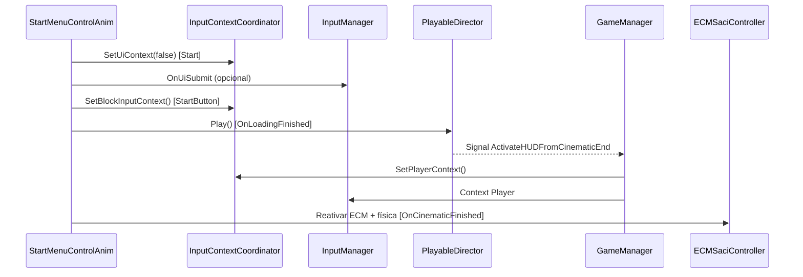
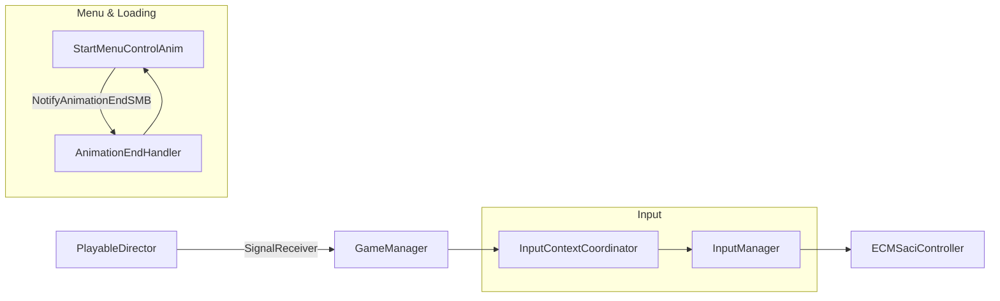

# Integração do Menu Inicial, Cinemática e Input (Guia de Referência)

Este documento descreve a arquitetura e as configurações necessárias para que o fluxo Menu Inicial → Loading → Cinemática → Gameplay funcione de forma consistente, sem bloquear movimento/pulo e sem perder eventos de animação. É obrigatório seguir estas instruções ao editar os componentes listados.

## Visão Geral do Fluxo

- StartMenuControlAnim controla o estado inicial: bloqueia input, exibe UI do menu, inicia loading e ativa a cinemática.
- A cinemática dispara sinais/eventos no fim para liberar gameplay e exibir HUD.
- InputContextCoordinator é o único ponto que troca os contextos de input (Player/UI/BlockInput) e controla interações da UI.
- InputManager centraliza o input do jogador via `StarterAssets` (maps Player e UI) e expõe valores e eventos.
- ECMSaciController lê movimento/pulo a partir do InputManager, garantindo resposta após o término da cinemática.
- NotifyAnimationEndSMB + AnimationEndHandler tratam eventos de término (ou marcos de tempo) das animações, inclusive sem transição de estado.

## Componentes e Responsabilidades

- `Assets/Scripts/UI/StartMenuControlAnim.cs`
  - Bloqueia input e física do player no início.
  - Inicia a animação de loading e, ao terminar, ativa a cinemática e toca a Timeline (`PlayableDirector`).
  - No fim da cinemática, chama `InputContextCoordinator.SetPlayerContext()` e reabilita o `ECMSaciController` e o `Rigidbody`.
  - Pode usar `GameManager.ActivateHUDFromCinematicEnd()` via `SignalReceiver` da Timeline para exibir HUD.

- `Assets/Scripts/UI/NotifyAnimationEndSMB.cs`
  - StateMachineBehaviour que dispara eventos de fim de animação sem depender de transição de estado.
  - Configurável por `percentThreshold` (0–100) e `eventKey` para acionar eventos nomeados via `AnimationEndHandler`.
  - Suporta disparo em `OnStateExit` (quando há transição) e em `OnStateUpdate` pelo tempo normalizado.

- `Assets/Scripts/UI/AnimationEndHandler.cs`
  - Componente de destino dos eventos de fim de animação.
  - Mantém um `UnityEvent` padrão (`OnAnimationFinished`) e uma lista de eventos nomeados (chave → `UnityEvent`).
  - Método `TriggerAnimationEventByKey(string key)` dispara o evento pela chave; se vazio ou não encontrado, usa o padrão.

- `Assets/Scripts/Managers/InputManager.cs`
  - Singleton que instancia `StarterAssets` e alterna entre mapas `Player` e `UI` (e bloqueio completo).
  - Exponde valores contínuos: `Move`, `Look`, `Jump`, `Sprint`.
  - Exponde eventos: `OnTornado`, `OnProjetarTornado`, `OnUiSubmit`, `OnPause`.
  - Fornece `ConsumeJumpInput()` para evitar “pulo travado”.

- `Assets/Scripts/Managers/InputContextCoordinator.cs`
  - Único ponto que chama `SetPlayerContext`, `SetUiContext`, `SetBlockInputContext` no `InputManager`.
  - Habilita/Desabilita `InputSystemUIInputModule` e gerencia foco via `EventSystem`.
  - API utilitária: `EnableUiInteractions(defaultFocus)`, `DisableUiInteractions()`.

- `Assets/Scripts/Managers/GameManager.cs`
  - Orquestra pausa, respawn e HUD.
  - Expõe `ActivateHUDFromCinematicEnd()` para ser chamado por sinal da Timeline no fim da cinemática (reativa gameplay, mostra HUD).
  - Garante bloqueio de input durante respawn e alterna contextos apropriadamente.

- `Assets/Scripts/_Quarantine/Player_Redundant/ECMSaciController.cs`
  - Agora lê `Move` e `Jump` do `InputManager.Instance` (com fallback para `StarterAssetsInputs`).
  - Consome pulo via `InputManager.Instance.ConsumeJumpInput()` e mantém buffer para responsividade.
  - Respeita gating de input (UI/spline) e integra com Animator e ECM.

## Checklist de Configuração (Inspector)

1) StartMenuControlAnim
- `cinematicObject`: arrastar o root da cinemática (GameObject com Timeline/PlayableDirector).
- `cinematicDirector`: opcional; se vazio, é obtido de `cinematicObject`.
- `canvasUI` e `canvasHUD`: referenciados corretamente.
- `defaultUiButton`: botão que recebe foco ao entrar no menu.
- `LoadingAnimator`, `logoGroupAnimator`, `uiPanelsAnimator`: atribuídos e com triggers esperados.
- Animation Events:
  - No fim do estado de loading: chamar `AnimationEndHandler.TriggerAnimationEventByKey("LoadingFinished")` para encadear `OnLoadingFinished()` ou chamar diretamente `StartMenuControlAnim.OnLoadingFinished()` se preferir evento padrão.
  - No fim da cinemática: sinal da Timeline chama `GameManager.ActivateHUDFromCinematicEnd()` e/ou `StartMenuControlAnim.OnCinematicFinished()`.

2) NotifyAnimationEndSMB (por estado no Animator)
- `triggerOnNormalizedTime`: ligar para detectar término sem transição.
- `percentThreshold`: defina o percentual do progresso (ex.: 98, 75, 50 conforme necessidade de marca).
- `eventKey`: chave que o `AnimationEndHandler` vai tratar (ex.: `LoadingFinished`, `CinematicFinished`).
- `invokeOnce`: mantenha ligado para evitar multiplas invocações.
- Opcional: `triggerOnStateExit` ligado quando o fluxo usa transições de estado.

3) AnimationEndHandler (no mesmo GO do Animator, ou em filhos/pais)
- Preencha `OnAnimationFinished` para retrocompatibilidade.
- Adicione entradas em `events` com `key` e `UnityEvent` correspondentes.
  - Ex.: key `LoadingFinished` → chama `StartMenuControlAnim.OnLoadingFinished()`.
  - Ex.: key `CinematicFinished` → chama `StartMenuControlAnim.OnCinematicFinished()`.

4) Input Manager e UI
- Garanta um único `InputManager` ativo (persistente via `DontDestroyOnLoad`).
- Verifique que `InputContextCoordinator` existe e possui acesso a `EventSystem` e `InputSystemUIInputModule`.
- A Timeline deve ter `SignalReceiver` para `GameManager.ActivateHUDFromCinematicEnd()`.

5) Player Controller
- O objeto do jogador deve ter `ECMSaciController` único e `Rigidbody` referenciado.
- Durante o menu/Loading, `ECMSaciController.enabled = false` e `Rigidbody.isKinematic = true`.
- Após a cinemática, `isKinematic = false` e `ECMSaciController.enabled = true`.

## Sequência Operacional

1. Start do Menu
- `StartMenuControlAnim.Start()` bloqueia input (`SetUiContext(false)`), oculta HUD, e congela o player.
- Animações do logo e painéis são disparadas.

2. Loading
- `AtivarLoadingScreen()` dispara Trigger `StartLoading` no `LoadingAnimator` e bloqueia input (`SetBlockInputContext`).
- Ao terminar, um `AnimationEndHandler` (via `NotifyAnimationEndSMB`) chama `StartMenuControlAnim.OnLoadingFinished()`.

3. Cinemática
- `OnLoadingFinished()` ativa `cinematicObject` e dispara `PlayableDirector.Play()`.
- A Timeline emite sinal `ActivateHUDFromCinematicEnd()` no `GameManager` para exibir HUD.
- No fim, `OnCinematicFinished()` libera input do jogador (`SetPlayerContext()`), reativa física e `ECMSaciController`.

## Logs Esperados (para Depuração)

- `[StartMenuControlAnim] AtivarLoadingScreen() invocado`
- `[StartMenuControlAnim] OnLoadingFinished() invocado`
- `[StartMenuControlAnim] PlayableDirector.Play() disparado para a cinemática`
- `[NotifyAnimationEndSMB] Disparado por normalizedTime ... key='...' nt=... cycle=... loop=...`
- `[AnimationEndHandler] Disparando evento nomeado '...'` ou aviso de fallback
- `[GameManager] ActivateHUDFromCinematicEnd()` (quando aplicável)

## Regras de Alteração (para evitar regressões)

- Troca de contexto de input deve acontecer somente via `InputContextCoordinator`.
- Não desabilitar o asset inteiro de input; alternar os mapas Player/UI conforme `InputManager`.
- Ao encerrar estados no Animator que não têm transição, usar `NotifyAnimationEndSMB` com `triggerOnNormalizedTime`.
- Para marcos específicos (meio/fim), usar `percentThreshold` apropriado.
- Ao finalizar cinemática, garantir:
  - `InputContextCoordinator.SetPlayerContext()`
  - `Rigidbody.isKinematic = false`
  - `ECMSaciController.enabled = true`
- ECMSaciController deve ler `Move` e `Jump` do `InputManager.Instance` e consumir o pulo via `ConsumeJumpInput()`.

## Testes Rápidos

- Menu: Submit e clique no botão Start iniciam loading e cinemática.
- Cinemática: ao terminar, movimento (WASD/Stick) e pulo funcionam; tornado segue no cooldown.
- Pause: se habilitado, alterna UI e Player corretamente, cursor é bloqueado/liberado.
- Respawn: input bloqueado durante countdown, retomado ao terminar.

## Perguntas Frequentes (FAQ)

1) O ataque funciona, mas o movimento/pulo não responde após a cinemática.
- Verifique se `InputContextCoordinator.SetPlayerContext()` é chamado ao final.
- Confirme que `ECMSaciController` está habilitado e o `Rigidbody` não é kinematic.
- Assegure que `InputManager.Instance` está presente (singleton) e ativo.

2) O evento de fim de animação não dispara.
- Use `NotifyAnimationEndSMB` com `triggerOnNormalizedTime` e defina `percentThreshold`.
- Confirme `AnimationEndHandler` no mesmo GO (ou filhos/pais) do `Animator`. Verifique a `eventKey`.

3) O evento dispara múltiplas vezes.
- Mantenha `invokeOnce = true` e verifique se não há múltiplos `NotifyAnimationEndSMB` no mesmo estado.

4) O pause entra sozinho ao abrir o jogo.
- O `InputManager` tem debounce (`_pauseInputLockUntil`); não remova.

---

Manter este guia atualizado ao alterar qualquer um dos componentes listados. Seguir à risca evita deadlocks de input, perda de foco da UI e falhas de disparo de eventos na Timeline/Animator.

## Referências Diretas por Arquivo

- `Assets/Scripts/UI/StartMenuControlAnim.cs`
  - `EnterUiContextWithFocus()` linha 87
  - `EnableUiInteractionsWithFocus()` linha 92
  - `DisableUiInteractionsPublic()` linha 97
  - `EnterPlayerContextPublic()` linha 102
  - `EnterBlockInputContextPublic()` linha 107
  - `AtivarMainMenuStart()` linha 112
  - `AtivarMainMenuLateStart()` linha 169
  - `DesativarMainMenuPanels()` linha 181
  - `OnStartButtonClicked()` linha 207
  - `EnableProvisionalAdvance()` linha 224
  - `DisableProvisionalAdvance()` linha 236
  - `AtivarLoadingScreen()` linha 255
  - `OnLoadingFinished()` linha 304
  - `ForceActivateAndPlayCinematic()` linha 338
  - `OnCinematicFinished()` linha 344

- `Assets/Scripts/UI/NotifyAnimationEndSMB.cs`
  - Campo `percentThreshold` linha 18
  - Campo `eventKey` linha 21
  - `OnStateEnter(...)` linha 28
  - `OnStateUpdate(...)` linha 34
  - `OnStateExit(...)` linha 65

- `Assets/Scripts/UI/AnimationEndHandler.cs`
  - `TriggerAnimationEndEvent()` linha 27
  - `TriggerAnimationEventByKey(string key)` linha 37

- `Assets/Scripts/Managers/InputManager.cs`
  - `SetPlayerContext()` linha 47
  - `SetUiContext()` linha 48
  - `SetBlockInputContext()` linha 49
  - `ConsumeJumpInput()` linha 135

- `Assets/Scripts/Managers/InputContextCoordinator.cs`
  - `SetUiContext(bool enableUiInteractions = true, GameObject defaultFocus = null)` linha 52
  - `SetPlayerContext()` linha 67
  - `SetBlockInputContext()` linha 80
  - `EnableUiInteractions(GameObject defaultFocus = null)` linha 93
  - `DisableUiInteractions()` linha 102

- `Assets/Scripts/Managers/GameManager.cs`
  - `SetStartMenuActive(bool active)` linha 75
  - `TogglePause()` linha 78
  - `ActivateHUDFromCinematicEnd()` linha 257

- `Assets/Scripts/_Quarantine/Player_Redundant/ECMSaciController.cs`
  - `HandleInput()` linha 234
  - `Awake()` linha 319
  - `EnterSplinePathMode()` linha 369
  - `ExitSplinePathMode()` linha 382
  - `OnValidate()` linha 434

## Playbook de Verificação Pós-Merge (QA)

- Preparação
  - Abrir a cena principal e garantir `InputManager`, `InputContextCoordinator` e `GameManager` ativos.
  - Verificar `StartMenuControlAnim` com referências atribuídas (UI, HUD, Animators, `cinematicObject`).
  - Confirmar `AnimationEndHandler` e `NotifyAnimationEndSMB` nos estados corretos, com `eventKey` definido.

- Menu e Loading
  - Ao entrar no Play, HUD e UI ocultas; cursor visível; input bloqueado (`SetUiContext(false)`).
  - Pressionar Start: observar log `[StartMenuControlAnim] AtivarLoadingScreen()` e `SetBlockInputContext()`.
  - Loading executa e dispara `OnLoadingFinished()` via SMB/Handler (checar log).

- Cinemática
  - `PlayableDirector.Play()` é chamado e timeline inicia; checar que SignalReceiver invoca `GameManager.ActivateHUDFromCinematicEnd()`.
  - Ao fim, `OnCinematicFinished()` libera `SetPlayerContext()` e reativa `ECMSaciController` e física.

- Gameplay retomado
  - Testar movimento (WASD/Stick) e pulo; confirmar `InputManager.Move/Jump` atualizando.
  - Executar tornado; confirmar eventos pelo `InputManager` e cooldown UI.
  - Pausar e despausar: `TogglePause()` alterna entre UI e Player e cursor bloqueia/libera.

- Respawn (se aplicável)
  - Forçar morte/respawn; verificar bloqueio no countdown e retorno com `SetPlayerContext()`.

- Roubustez
  - Desabilitar temporariamente transições no estado de término da animação e confirmar SMB disparando por `normalizedTime`.
  - Alterar `percentThreshold` para 50% e validar marcadores intermediários.

## Diagramas (Mermaid)

 
## Notas internas: o que o `StartMenuControlAnim` faz e por que não é tão reutilizável

Estas notas são para revisão interna e podem ser removidas ou movidas para outro arquivo posteriormente.

### O que o componente faz hoje
- Entra em contexto de UI e bloqueia input de gameplay ao iniciar.
- Habilita interações de UI e força foco no botão definido via `EventSystem`.
- Oculta/mostra partes da UI e HUD conforme fase do fluxo.
- Controla `Loading` via `Animator` com triggers `StartLoading` e `StopLoading`.
- Ao finalizar o Loading, ativa o objeto de Cinemática e inicia a `Timeline` (`PlayableDirector.Play()`).
- Ao final da Cinemática, troca para contexto de Player e desabilita interações de UI.
- Trava a física do jogador ao iniciar (ex.: `Rigidbody.isKinematic = true`) e limpa as velocidades.
- Desabilita o controlador específico do jogador (ex.: `ECMSaciController`) ao iniciar.
- Restaura física e controlador ao final da Cinemática.
- Usa utilitários como `EnsureParentsActive` para garantir ativação em cadeia dos objetos-pai.
- Realiza marcações de estado no `GameManager` (ex.: `SetStartMenuActive(true/false)`).
- Gera logs detalhados para cada fase (UI, Loading, Cinemática, Gameplay).
- Possui um mecanismo de “avanço provisório” via submissão de UI para testar rapidamente o fluxo.

### Por que ele não é facilmente reutilizável
- Dependência rígida de nomes e triggers de `Animator` específicos (ex.: `StartLoading`, `StopLoading`), sem fallback padronizado.
- Assumir diretamente a existência de um `PlayableDirector` na Cinemática, acoplando o fluxo a Timeline.
- Controle direto de física do jogador (`Rigidbody`) e de um controlador concreto (`ECMSaciController`), criando dependência de implementação.
- Mistura responsabilidades de UI (foco, interações), Loading e controle de Player em um único componente.
- Dependência de `GameManager` para marcação de estado e player, reduzindo portabilidade entre cenas/projetos.
- Gestão de HUD/UI acoplada: presume objetos e hierarquias específicas de Canvas/HUD.
- Foco via `EventSystem` com um botão padrão definido em campo; pode falhar se a cena não tiver esse objeto.
- Ordem operacional e suposições implícitas: bloqueio de input no início, reativação apenas após Cinemática, não configurável por fase.
- Não parametriza claramente fases e políticas (ex.: travar física sempre no início), tornando difícil adaptá-lo a outros cenários.

### Observações para refatoração/migração
- Parametrizar via campos/flags todas as ações acopladas: travar/destravar física, desabilitar/habilitar controlador, triggers e nomes.
- Separar responsabilidades em componentes/coordenadores específicos (UI, Loading, Cinemática, PlayerControl).
- Injetar dependências (player, HUD, Canvas, Director) em vez de buscá-las por singletons/nomes.
- Expor eventos/hooks por fase: `OnPreUI`, `OnLoadingStart/End`, `OnCinematicStart/End`, `OnHandoffToGameplay`.
- Usar `SceneEntryFlowCoordinator` como fachada reutilizável, mantendo lógica especializada em scripts dedicados.